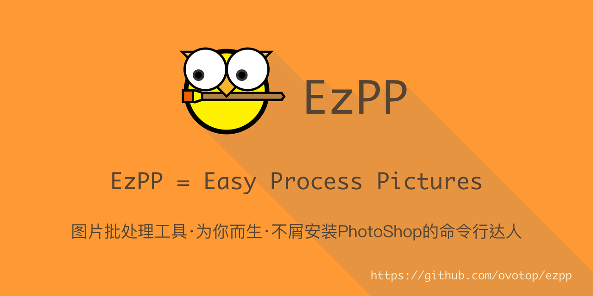
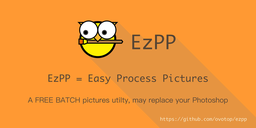
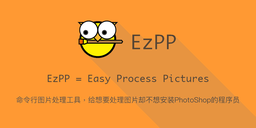

[English Document](README.md)

# 1. 安装

```bash
pip3 install ezpp
```

# 2. EzPP能做什么？

功能名称|处理前|处理后|How to
:---:|:---:|:---:|:---
毛玻璃(Frosted)|||[怎样做毛玻璃➡️](docs/subcmd_04_frosted.md)
变色(ReColor)||.png)|[怎样改色➡️](docs/subcmd_01_recolor.md)
调整大小(ReSize)|||[怎样改大小➡️](docs/subcmd_02_resize.cn.md)
转格式(ReFormat)|lego_mc_l.jpg(203k)|lego_mc_l.webp(109k)|[怎样改格式➡️](docs/subcmd_03_reformat.cn.md)
文本变图标(Text2Icon)| "EzPP"||[文本怎样变图标➡️](docs/subcmd_05_text2icon.cn.md)
加阴影(Shadow)|||[怎样加阴影➡️](docs/subcmd_06_shadow.cn.md)
布局渲染(Layout)|ezpp_slogan.cn.yaml||[怎样渲染布局](examples/render/examples_render.cn.md)

# 3. 常用参数

## 输入文件
### 用 '-i' 或 '--infile' 提供输入文件.

只有 text2icon 这个子命令不支持也不需要 -i

## 输出文件
### 使用 '-o' 或 '--outfile'提供输出文件.
                            
如果你同时提供了'-p' 或 '--preview' 标志。输出文件将会被忽略


## 递归处理图片

使用-r递归地处理图像

```text
$ ezpp recolor -r -i docs/ -h 90
$ ezpp frosted -r -i docs
```

使用--overwrite覆盖原图而非创建新图

下面这条命令遍历docs下的图，将其转化为毛玻璃特效，直接覆盖原图

```text
$ ezpp frosted -r --overwrite -i docs
```

各个子命令对递归调用的支持情况如下。

子命令|是否支持递归
:---:|:---:
frosted|yes
recolor|yes
refmt|yes
resize -s|yes
resize -a|no
text2icon |no
shadow |yes
render |no

------ 
# 待开发功能

- [ ] 1. 在给图片换色的时候，忽略某些颜色.

Recolor with -i flag

- [Done] 2. 给一个目录下所有的图片 换色/改大小 


- [ ] 3. 本地化帮助文档

https://www.cnblogs.com/ldlchina/p/4708442.html

https://docs.python.org/3/library/gettext.html

- [Done] 4. 在转化完图片后打开预览查看结果，并且能通过参数控制是否显示预览。

- [Done] 5. 布局渲染
- [ ] 6. 以行和列的形式布局
- [ ] 7. Gif 动画