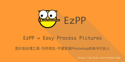

# 安装

```bash
pip install ezpp
```

# EzPP能做什么？

功能名称|处理前|处理后
:---:|:---:|:---:
毛玻璃(Frosted)||
变色(ReColor)||
调整大小(ReSize)||
转格式(ReFormat)|lego_mc_l.jpg(203k)|lego_mc_l.webp(109k)|
文本变图标(Text2Icon)| "EzPP"|
加阴影(Shadow)||
布局渲染(Layout)|ezpp_slogan.yaml||

# 怎样用
## 1. 图片换色
### 1.1 图片换色,通过指定色值换色

参数范围：

-u(h**u**e) [0,360]

-s(**s**aturation) [-1.0,1.0]

-v(**v**alue) [-1.0,1.0]

#### 在命令行输入:
```text
$ezpp caojianfeng$ ezpp recolor -i docs/icon.png -c '#ff0000'
```
#### 输出
```text
docs/icon.png + #ff0000 -> docs/icon_0xff0000.png
```
#### 结果:
|修改前|修改后 recolor -c #ff0000 |
|:---:|:---:|
|||

#### 在命令行输入: with out -o:
```text
$ ezpp recolor -i docs/logo_256x256.png -o docs/logo_blue.png -c '#3399ff'
```
#### 输出
```text
docs/logo_256x256.png + #3399ff -> docs/logo_blue.png
```

#### 结果:
|修改前|修改后 #recolor -c #3399ff|
|:---:|:---:|
|||

### 1.2 图片换色,通过指定HSV值换色


#### 在命令行输入:
```text
$ ezpp recolor -i docs/lego_mc.jpg -h 90
$ ezpp recolor -i docs/lego_mc.jpg -s -1.0
$ ezpp recolor -i docs/lego_mc.jpg -v 1.0
```
#### 输出
```text
docs/lego_mc.jpg + hsv_s(0.5) -> docs/lego_mc_s(0.5).jpg
```
#### 结果:
change s of hsv|effect|change s of hsv|effect|change v of hsv|effect
:---:|:---:|:---:|:---:|:---:|:---:
修改前||修改前||修改前|
修改后 -u 0 |.jpg)|修改后  -s 1.0 |.jpg)|修改后  -v 0.8 |.jpg)
修改后 -u 60 |.jpg)|修改后  -s 0.5 |.jpg)|修改后  -v 0.5 |.jpg)
修改后 -u 120 |.jpg)|修改后  -s -0.5 |.jpg)|修改后  -v -0.5 |.jpg)
修改后  -u 240 |.jpg)|修改后  -s -1.0 |.jpg)|修改后  -v -0.8 |.jpg)

## 2. 图片改尺寸
### 2.1. Resize one by size

#### 在命令行输入:
```text
ezpp resize -i docs/logo_256x256.png -o docs/logo_64.png -s 64
```
#### 输出
```text
resize: (256, 256)->(64, 64)
from:   /Volumes/user/cjf/w/ezpp/docs/logo_256x256.png
to:     /Volumes/user/cjf/w/ezpp/docs/logo_64.png
```
#### 结果:
|修改前|修改后 resize -s 64|
|:---:|:---:|
|||

### 2.2. Resize one by width and height

#### 在命令行输入:
```text
$ ezpp resize -i docs/lego_mc.jpg -s 160x90
```
#### 输出
```text
resize: (286, 197)->(160, 90)
from:   /Volumes/user/cjf/w/ezpp/docs/lego_mc.jpg
to:     /Volumes/user/cjf/w/ezpp/docs/lego_mc_160x90.jpg
```
#### 结果:
|修改前|修改后 resize -s 160x90|
|:---:|:---:|
|||


### 2.3. Resize one by percent

#### 在命令行输入:
```text
$ ezpp resize -i docs/lego_mc.jpg -s 12.5%
```
#### 输出
```text
resize: (286, 197)->(35, 24)
from:   /Volumes/user/cjf/w/ezpp/docs/lego_mc.jpg
to:     /Volumes/user/cjf/w/ezpp/docs/lego_mc_35x24.jpg
```
#### 结果:
|修改前|修改后 resize -s 12.5%|修改后 resize -s 25%|
|:---:|:---:|:---:|
||||


### 2.4. 生成应用图标

用一个1024x1024的应用图标，生成安卓和iOS需要的所有大小的图标。

#### 在命令行输入:
```text
$ezpp resize -i playground/logo.png -a
```

#### 输出:
```text
[1/24]--------- RESIZE ----------
resize: (1024, 1024)->(40, 40)
from:   /Volumes/user/cjf/w/ezpp/playground/logo.png
to:     /Volumes/user/cjf/w/ezpp/playground/logo.png.out/ios/AppIcon.appiconset/Icon-App-20x20@2x.png
[2/24]--------- RESIZE ----------
resize: (1024, 1024)->(60, 60)
from:   /Volumes/user/cjf/w/ezpp/playground/logo.png
to:     /Volumes/user/cjf/w/ezpp/playground/logo.png.out/ios/AppIcon.appiconset/Icon-App-20x20@3x.png

...

[24/24]--------- RESIZE ----------
resize: (1024, 1024)->(192, 192)
from:   /Volumes/user/cjf/w/ezpp/playground/logo.png
to:     /Volumes/user/cjf/w/ezpp/playground/logo.png.out/android/res/mipmap-xxxdpi/ic_launcher.png
[1/1]--------- COPY ----------
from:    /Library/Frameworks/Python.framework/Versions/3.6/lib/python3.6/site-packages/ezpp-0.0.3-py3.6.egg/ezpp/resize_cfg/Contents.json
copy to: /Volumes/user/cjf/w/ezpp/playground/logo.png.out/ios/AppIcon.appiconset/Contents.json
```

#### 结果:
```text
logo.png.out/
├── android
│   └── res
│       ├── mipmap-hdpi
│       │   └── ic_launcher.png
│       ├── mipmap-mdpi
│       │   └── ic_launcher.png
│       ├── mipmap-xhdpi
│       │   └── ic_launcher.png
│       ├── mipmap-xxhdpi
│       │   └── ic_launcher.png
│       └── mipmap-xxxhdpi
│           └── ic_launcher.png
├── android_stores
│   ├── 1024.png
│   ├── 16.png
│   ├── 216.png
│   ├── 256.png
│   └── 512.png
└── ios
    └── AppIcon.appiconset
        ├── Contents.json
        ├── Icon-App-1024x1024@1x.png
        ├── Icon-App-20x20@1x.png
        ├── Icon-App-20x20@2x.png
        ├── Icon-App-20x20@3x.png
        ├── Icon-App-29x29@1x.png
        ├── Icon-App-29x29@2x.png
        ├── Icon-App-29x29@3x.png
        ├── Icon-App-40x40@1x.png
        ├── Icon-App-40x40@2x.png
        ├── Icon-App-40x40@3x.png
        ├── Icon-App-60x60@2x.png
        ├── Icon-App-60x60@3x.png
        ├── Icon-App-76x76@1x.png
        ├── Icon-App-76x76@2x.png
        └── Icon-App-83.5x83.5@2x.png
```

call from terminal
```bash
ezpp resize -i playground/logo.png -a -o playground/logos
```
Will output resized logos  to folder "playground/logos"

## 3. 改图片格式

#### 在命令行输入:
```text
$ ezpp refmt -i playground/lego_mc_l.jpg  -f WEBP
```
#### 输出
```text
comvert: WEBP
from:   /Volumes/user/cjf/w/ezpp/playground/lego_mc_l.jpg
to:     /Volumes/user/cjf/w/ezpp/playground/lego_mc_l.webp
```

#### 结果:
|修改前|修改后 refmt -f WEBP|
|:---:|:---:|
|lego_mc_l.jpg(203k)|lego_mc_l.webp(109k)|


## 4. 毛玻璃效果

#### 在命令行输入:
```text
ezpp frosted -i docs/lego_mc.jpg 
```
#### 输出
```text
docs/lego_mc.jpg frosted(size = 10) -> docs/lego_mc_frosted.jpg
```
#### 结果:
|修改前|修改后 frosted default(-s 10)|
|:---:|:---:|
|||


#### 在命令行输入: with '-s 5':

default -s is 10
-s = 5 will be clearly


```text
$ ezpp frosted -i docs/lego_mc.jpg  -s 5
```
#### 输出
```text
docs/lego_mc.jpg frosted(size = 5) -> docs/lego_mc_frosted.jpg
```
#### 结果
|修改前|修改后 frosted(-s 5)|修改后 frosted(-s 10) default|
|:---:|:---:|:---:|
||||


## 5. 纯文本图标:

### 最简单的调用
#### 在命令行输入:


```
ezpp text2icon -t "EzPP"
```

#### 输出
```text
text2icon:[title:EzPP,subtitle:None,color:#ffffff,bgcolor:#3399ff]
```
#### 结果:


### 指定颜色、字体和副标题

选项|功能
:---|:---
-t 或者 --title|指定主标题
-s 或者 --subtitle|指定副标题
-c 或者 --color|指定前景色
-b 或者 --bgcolor|指定背景色
-F 或者 --font|指定主标题字体
-f 或者 --subfont|指定副标题字体

你可以在以下目录找到你需要的字体
```
/System/Library/fonts
~/Library/Fonts
/Library/Fonts
```

#### 在命令行输入:
```
ezpp text2icon -t "EzPP" -s "ovo.top" -o playground/ezpp_cm.png -c "#543" -b "#f93" -F /System/Library/fonts/Courier.dfont -f /System/Library/fonts/Monaco.dfont
```

#### 输出
```text
text2icon:
[
        title:(EzPP,font:/System/Library/fonts/Courier.dfont),
        subtitle:(ovo.top,subfont:/System/Library/fonts/Monaco.dfont),
        color:#543,
        bgcolor:#f93
]
```

#### 结果


## 6. 加阴影:

给一个有单色背景的图标加阴影

### 最简单的调用

#### 在命令行输入:

```
ezpp shadow -i docs/ezpp_t_128.png 
```

#### 输出
```text
shadow file with alpha= 0.5:
docs/ezpp_t_128.png 
to docs/ezpp_t_128_shadow.png
```
#### 结果

|Before|After|
|:---:|:---:|
|

### 控制阴影颜色


#### 在命令行输入:

```
ezpp shadow -i docs/ezpp_t_128.png  -a 0.2
```

#### 输出
```text
shadow file with alpha= 0.2:
docs/ezpp_t_128.png 
to docs/ezpp_t_128_shadow.png
```
#### 结果:

Before| alpha 0.2|Default(0.5)|alpha 0.8
:---:|:---:|:---:|:---:
|||


## 递归处理图片

使用-r递归地处理图像

```text
$ ezpp recolor -r -i docs/ -h 90
$ ezpp frosted -r -i docs
```

使用--overwrite覆盖原图而非创建新图

下面这条命令遍历docs下的图，将其转化为毛玻璃特效，直接覆盖原图

```text
$ ezpp frosted -r --overwrite -i docs
```

各个子命令对递归调用的支持情况如下。

子命令|是否支持递归
:---:|:---:
frosted|yes
recolor|yes
refmt|yes
resize -s|yes
resize -a|no
text2icon |no
shadow |yes

------ 
# 待开发功能
## 1. 在给图片换色的时候，忽略某些颜色.

Recolor with -i flag

## 2. 给一个目录下所有的图片 换色/改大小


## 3. 本地化帮助文档

https://www.cnblogs.com/ldlchina/p/4708442.html

https://docs.python.org/3/library/gettext.html

## 4. 在转化完图片后打开预览查看结果，并且能通过参数控制是否显示预览。