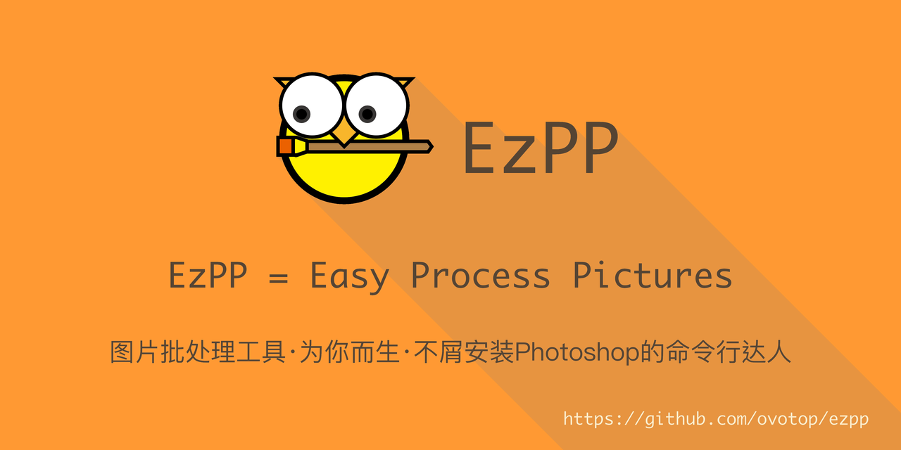

# 渲染子命令的例子

## 1. 入门例子hello_ezpp

这个例子显示了使用ezpp的基本的渲染方法.
1. 怎样使用 canvas。
2. 如何使用"text"类元素。
3. 如何通过filename属性自定义字体。
4. 如何通过path属性自定义字体。

#### 从命令行输入
```text
ezpp render -i examples/render/hello_ezpp/hello.yaml
ezpp render -i examples/render/hello_ezpp/hello_custom_font.yaml
```

examples/render/hello_ezpp/hello.yaml
```yaml
# ezpp render -i examples/render/hello_ezpp/hello.yaml
canvas:
  width: 240
  height: 80
  color: "#f93"  # "#RGBA" or "#RRGGBBAA"

items:
- 
  type: "text"
  title: "Hello, EzPP"
  pos:
    x: "center"
    y: "center"
  font:
    path: "/System/Library/fonts/Monaco.dfont"
    # filename: "ZhenyanGB.ttf"
    size: 24
    color: "#543"
```
#### 输出

如果你提供一个参数'--silent'就可以关闭下面的输出

```text
FROM: examples/render/hello_ezpp/hello.yaml
TO: examples/render/hello_ezpp/hello.png
FROM: examples/render/hello_ezpp/hello_custom_font.yaml
TO: examples/render/hello_ezpp/hello_custom_font.png
```

#### 结果:


## 2. 使用参数params

这个例子展示了如何利用参数来重用你的 *.yaml 文件。
1. 如何使用"image"类元素。
2. 如何使用"shadow"类元素。
3. 如何使用参数。

#### 从命令行输入:
```text
ezpp render -i examples/render/params/params.yaml  -a '{"icon":"logo_256x256.png","title":"Hello EzPP"}' -o examples/render/params/hello_ezpp.png
```
examples/render/params/params.yaml
```yaml
# params defines
params: 
  - "title"
  - "icon"

canvas:
  width: 256
  height: 80
  color: "#f93" 

items:
-
  type: "image"
  filename: "__icon__" # params using
  pos:
    x: 16
    y: "center"
- 
  title: "__title__" # params using
  type: "text"
  visible: true
  pos:
    x: 96
    y: "center"
  font:
    path: "/System/Library/fonts/Monaco.dfont"
    size: 24
    color: "#543"
        
-
  type: "shadow"
  alpha: 0.1 # 0.0-1.0  shadow color is #000a

```
#### 输出
```text
FROM: examples/render/params/params.yaml
TO: examples/render/params/hello_ezpp.png
```

#### 结果:


#### 参数有力量!

你也可像这样创建一个 *.sh.

examples/render/params/render_params_demo.sh:
```bash
cd examples/render/params
ezpp render -i params.yaml -a '{"icon":"logo_64.png"}' -o def.png
ezpp render -i params.yaml -a '{"icon":"logo_64.png","title":"Hello"}' -o hello.png
ezpp render -i params.yaml -a '{"icon":"logo_64.png","title":"EzPP"}' -o ezpp.png
ezpp render -i params.yaml -a '{"icon":"logo_64.png","title":"Hello EzPP"}' -o hello_ezpp.png
cd ../../../
```

它将创建下列图片:


你还可以批量处理数据并自动调用 'ezpp render ***'.

## 3. 遮罩例子mask
这个例子展示了如何创建一个遮罩图层
1. 如何使用"image"类元素。
2. 如何使用"shadow"类元素。
3. 如何使用"nested"类元素。
4. 如何使用canvas的color属性。
5. 如何使用canvas的antialias_size属性。

#### 从命令行输入:
```text
ezpp render -i examples/render/mask/mask.yaml 
ezpp render -i examples/render/mask/mask_antialias.yaml 
```

examples/render/mask/mask.yaml 
```yaml
canvas:
#...

items:
-
  type: "image"
#...
-
  type: "shadow"
  alpha: 0.1
  
-
  type: "nested" # Just like a inline yaml file
  pos:
    x: 48
    y: "center"
  canvas:
    width: 204
    height: 72 
    antialias_size: 4 # 1,2,4,8,16 antialias range,The bigger the slower
    color: "#0006" # "#RGB6" means alpha = 6/16
  items:      
  - 
    type: "text"
    title: "EzPP"
    pos:
      x: "center"
      y: "center"
    font:
      path: "/System/Library/fonts/Monaco.dfont"
      size: 32
      color: "#543"
```
#### 输出
```text
FROM: examples/render/mask/mask.yaml
TO: examples/render/mask/mask.png
FROM: examples/render/mask/mask_antialias.yaml
TO: examples/render/mask/mask_antialias.png
```

#### 结果:

 bing nested to below:


## 4. slogan

这个例子显示了使用ezpp的进阶的渲染方法.
1. 如何使用"image"类元素。
2. 如何使用"shadow"类元素。
3. 如何使用"import"类元素来重用你的.yaml文件。

#### 从命令行输入:
```text
ezpp render -i examples/render/slogan/ezpp_slogan.yaml          
```

examples/render/slogan/ezpp_slogan.yaml 
```yaml
#...
items:
-
  type: "import"
  filename: "ezpp_slogan_top.yaml"
  pos:
    x: 0
    y: 0
#...
```

#### 输出
```text
FROM: examples/render/slogan/ezpp_slogan.yaml
TO: examples/render/slogan/ezpp_slogan.png
```

#### 结果:


