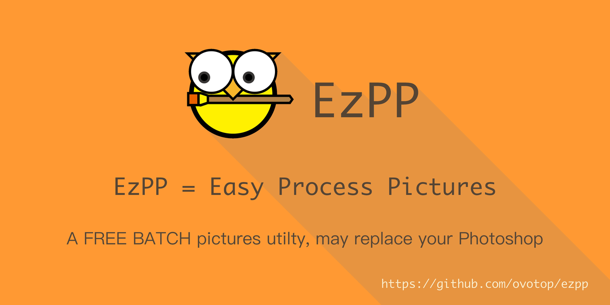

# Examples of ezpp render command

## 1. hello_ezpp

This example show basically using of ezpp render. 
1. How to use canvas.
2. How to use item type "text".
3. How to custom font by filename.
4. How to custom font by path.

#### Call from terminal
```text
ezpp render -i examples/render/hello_ezpp/hello.yaml
ezpp render -i examples/render/hello_ezpp/hello_custom_font.yaml
```

examples/render/hello_ezpp/hello.yaml
```yaml
# ezpp render -i examples/render/hello_ezpp/hello.yaml
canvas:
  width: 240
  height: 80
  color: "#f93"  # "#RGBA" or "#RRGGBBAA"

items:
- 
  type: "text"
  title: "Hello, EzPP"
  pos:
    x: "center"
    y: "center"
  font:
    path: "/System/Library/fonts/Monaco.dfont"
    # filename: "ZhenyanGB.ttf"
    size: 24
    color: "#543"
```
#### Output
```text
FROM: examples/render/hello_ezpp/hello.yaml
TO: examples/render/hello_ezpp/hello.png
FROM: examples/render/hello_ezpp/hello_custom_font.yaml
TO: examples/render/hello_ezpp/hello_custom_font.png
```

#### Result:


## 2. params

This example show how to use params to reuse your *.yaml file.
1. How to use item type "image".
2. How to use item type  "shadow".
3. How to use params.

#### Call from terminal:
```text
ezpp render -i examples/render/params/params.yaml  -a '{"icon":"logo_256x256.png","title":"Hello EzPP"}' -o examples/render/params/hello_ezpp.png
```
examples/render/params/params.yaml
```yaml
# params defines
params: 
  -
    name: "title"
    default: "DEF"
  - "icon"

canvas:
  width: 256
  height: 80
  color: "#f93" 

items:
-
  type: "image"
  filename: "__icon__" # params using
  pos:
    x: 16
    y: "center"
- 
  title: "__title__" # params using
  type: "text"
  visible: true
  pos:
    x: 96
    y: "center"
  font:
    path: "/System/Library/fonts/Monaco.dfont"
    size: 24
    color: "#543"
        
-
  type: "shadow"
  alpha: 0.1 # 0.0-1.0  shadow color is #000a

```

We can hide one item by set "visible: false".
"visible" default value is true.

#### Output
```text
FROM: examples/render/params/params.yaml
TO: examples/render/params/hello_ezpp.png
```

#### Result:


#### Power of params!

You can also make a *.sh file like this.

examples/render/params/render_params_demo.sh:
```bash
cd examples/render/params
ezpp render -i params.yaml -a '{"icon":"logo_64.png"}' -o def.png
ezpp render -i params.yaml -a '{"icon":"logo_64.png","title":"Hello"}' -o hello.png
ezpp render -i params.yaml -a '{"icon":"logo_64.png","title":"EzPP"}' -o ezpp.png
ezpp render -i params.yaml -a '{"icon":"logo_64.png","title":"Hello EzPP"}' -o hello_ezpp.png
cd ../../../
```

This shell will create these:


Or batch processing of datas. And call 'ezpp render ***' automatically.

## 3. mask
This example show how to create mask layer.
1. How to use item type "image".
2. How to use item type  "shadow".
3. How to use item type  "nested".
4. How to use canvas prop color.
5. How to use canvas prop antialias_size.

#### Call from terminal:
```text
ezpp render -i examples/render/mask/mask.yaml 
ezpp render -i examples/render/mask/mask_antialias.yaml 
```

examples/render/mask/mask.yaml 
```yaml
canvas:
#...

items:
-
  type: "image"
#...
-
  type: "shadow"
  alpha: 0.1
  
-
  type: "nested" # Just like a inline yaml file
  pos:
    x: 48
    y: "center"
  canvas:
    width: 204
    height: 72 
    antialias_size: 4 # 1,2,4,8,16 antialias range,The bigger the slower
    color: "#0006" # "#RGB6" means alpha = 6/16
  items:      
  - 
    type: "text"
    title: "EzPP"
    pos:
      x: "center"
      y: "center"
    font:
      path: "/System/Library/fonts/Monaco.dfont"
      size: 32
      color: "#543"
```
#### Output

You can provide a params '--silent' to close these output

```text
FROM: examples/render/mask/mask.yaml
TO: examples/render/mask/mask.png
FROM: examples/render/mask/mask_antialias.yaml
TO: examples/render/mask/mask_antialias.png
```

#### Result:


 bing nested to below:


## 4. slogan

This example show how to setup complex render.
1. How to use item type "image".
2. How to use item type  "shadow".
3. How to use item type "import" to reuse you .yaml file.

#### Call from terminal:
```text
ezpp render -i examples/render/slogan/ezpp_slogan.yaml          
```

examples/render/slogan/ezpp_slogan.yaml 
```yaml
#...
items:
-
  type: "import"
  filename: "ezpp_slogan_top.yaml"
  pos:
    x: 0
    y: 0
#...
```

#### Output
```text
FROM: examples/render/slogan/ezpp_slogan.yaml
TO: examples/render/slogan/ezpp_slogan.png
```

#### Result:


